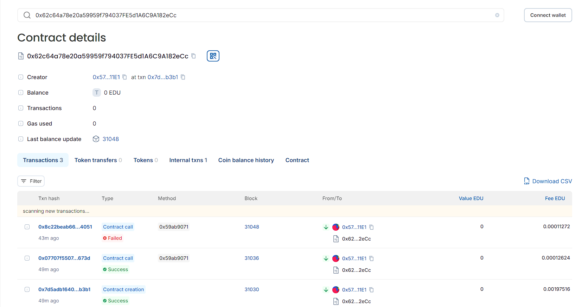

# Student Profile System

## Vision
<br/>

The `Student Profile System` is a decentralized platform designed to manage student profiles and academic resources efficiently on the Ethereum blockchain. Our goal is to create a transparent, immutable, and secure system where students can register, share resources, earn credits, and build a reputation based on their contributions to the academic community. The platform is designed to encourage collaboration and knowledge-sharing among students, while also providing a reward system that acknowledges valuable contributions.

## Flowchart

```plaintext
 +--------------------+        +----------------------------+        +--------------------+
 |                    |        |                            |        |                    |
 |  Register Student  +------->|  Add Resource (Student)    +------->|  Access Resource    |
 |                    |        |                            |        |                    |
 +--------+-----------+        +------------+---------------+        +--------------------+
          |                               |                                    |
          |                               v                                    v
          |                +----------------------------+        +--------------------+
          |                |                            |        |                    |
          |                |  Reward Student (Admin)    |        |  Redeem Credits     |
          |                |                            |        |                    |
          |                +----------------------------+        +--------------------+
          |                               |
          v                               v
 +--------------------+        +----------------------------+
 |                    |        |                            |
 |  Get Student       |        |  Get Resource              |
 |  Profile           |        |  Details                   |
 |                    |        |                            |
 +--------------------+        +----------------------------+
```

## Contract Address
The contract is deployed on the Ethereum mainnet/testnet at the following address:

- **Contract Address:** 0x62c64a78e20a59959f794037FE5d1A6C9A182eCc

You can interact with the contract through any Ethereum-compatible wallet or blockchain explorer.


## Features
- **Student Registration:** Secure and unique registration using student details and Ethereum address.
- **Resource Sharing:** Students can share academic resources and earn credits.
- **Resource Access:** Other students can access shared resources, contributing to the creator's reputation and credits.
- **Admin Privileges:** The admin can reward students with additional credits for outstanding contributions.
- **Credits Redemption:** Students can redeem credits for rewards, encouraging active participation.

## Future Scope
- **Integration with IPFS:** Implement IPFS for decentralized storage of resources.
- **NFT-based Certificates:** Develop a system where students can mint NFTs as proof of their academic achievements.
- **Cross-Institution Collaboration:** Expand the platform to support multiple educational institutions, allowing cross-institutional resource sharing and collaboration.
- **DAO Governance:** Transition to a decentralized autonomous organization (DAO) model, where decisions about the platform are made by the community of users.

## Contact
For any inquiries, contributions, or support, please contact:

- **Name:** Kh Deepak Kumar Singha
- **Email:** sanaba702@gmail.com
- **LinkedIn:** https://www.linkedin.com/in/deepak-singha-686b06297?utm_source=share&utm_campaign=share_via&utm_content=profile&utm_medium=android_app
- **GitHub:** https://github.com/Pekopekp

We welcome contributions from developers and educators who share our vision for a decentralized and collaborative academic ecosystem.

---